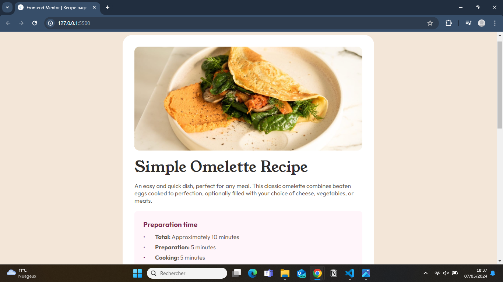

# Frontend Mentor - Recipe page solution

This is a solution to the [Recipe page challenge on Frontend Mentor](https://www.frontendmentor.io/challenges/recipe-page-KiTsR8QQKm). Frontend Mentor challenges help you improve your coding skills by building realistic projects.

## Table of contents

- [Overview](#overview)
  - [The challenge](#the-challenge)
  - [Screenshot](#screenshot)
  - [Links](#links)
- [My process](#my-process)
  - [Built with](#built-with)
  - [What I learned](#what-i-learned)
  - [Continued development](#continued-development)
- [Author](#author)

## Overview

### Screenshot

### Links

- Solution URL: [Here](https://recipepage-rose.vercel.app/)

## My process

### Built with

- Semantic HTML5
- CSS pseudo-element
- Lists
- em and rem sizes

### What I learned

### Continued development

## Author

- Github - [@chokrikadoussi](https://github.com/chokrikadoussi)
- Frontend Mentor - [@chokrikadoussi](https://www.frontendmentor.io/profile/chokrikadoussi)
